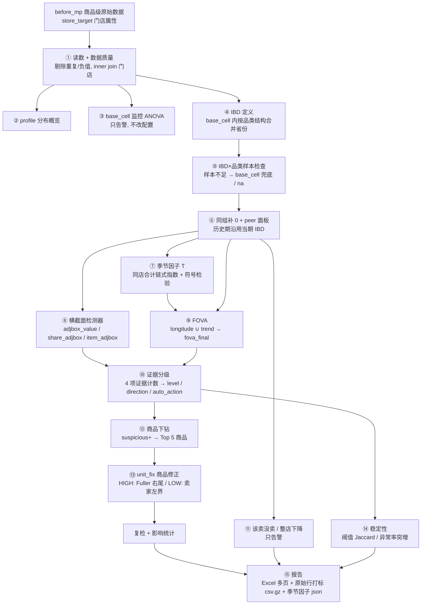
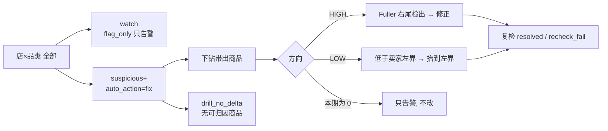

# O2O 门店×品类 peer outlier 检测与商品修正

对每一期 O2O 门店数据，在「相似门店」（peer）里找出销售额异常的 **门店×品类**，按证据数分级；只对证据足够的组合下钻到商品，并在商品级给出修正值、复检与影响统计。

- 生产入口：`peer_main.py`（单期运行，参数只读 `config/peer_params.json`）
- 核心代码：`code/core/`（各步骤）、`code/funcs/`（稳健统计、解析、日志）
- 每期重新计算：base_cell 监控、IBD、IBD×品类样本检查、季节因子、所有检测器。历史期按 **当期 IBD** 回溯。

---

## 目录

1. [流程图](#1-流程图)
2. [术语](#2-术语)
3. [步骤与规则](#3-步骤与规则)
   - [① 读数与数据质量](#-读数与数据质量)
   - [② 分布概览 profile](#-分布概览-profile)
   - [③ base_cell 监控（ANOVA）](#-base_cell-监控anova)
   - [④ IBD 定义（省份合并）](#-ibd-定义省份合并)
   - [⑤ IBD × 品类样本检查](#-ibd--品类样本检查)
   - [⑥ 同组补 0 与 peer 面板](#-同组补-0-与-peer-面板)
   - [⑦ 季节因子 T](#-季节因子-t)
   - [⑧ 横截面检测器（3 个）](#-横截面检测器3-个)
   - [⑨ FOVA：longitude + trend → fova_final](#-fovalongitude--trend--fova_final)
   - [⑩ 证据分级与自动动作](#-证据分级与自动动作)
   - [⑪ 该卖没卖 / 整店下降](#-该卖没卖--整店下降)
   - [⑫ 商品下钻](#-商品下钻)
   - [⑬ 商品修正 unit_fix](#-商品修正-unit_fix)
   - [⑭ 稳定性监控](#-稳定性监控)
   - [⑮ 报告与输出](#-报告与输出)
4. [参数表](#4-参数表)
5. [最近三期结果](#5-最近三期结果)
6. [已知限制与与原文档的偏离](#6-已知限制与与原文档的偏离)
7. [引用来源](#7-引用来源)
8. [运行、测试与回测](#8-运行测试与回测)

---

## 1. 流程图



修正链路的漏斗（每期 `fix_funnel` 页都会给出每一层的数量）：



---

## 2. 术语

| 术语 | 含义 |
|---|---|
| **base_cell** | 硬分层，`PLATFORMNAME × SHOPTYPE`。IBD 只在 base_cell 内部合并，跨 base_cell 不比较。不叫 cell。 |
| **IBD** | base_cell 内若干相似省份合成的门店组，`ibd_id = 平台\|店型\|Gnn`。 |
| **peer_group_id** | 某个 IBD×品类实际使用的对比组：本 IBD、`base_cell:...`（兜底）或 `na`（不检测）。 |
| **peer_level** | `ibd` / `ibd_merged` / `base_cell` / `na`。 |
| **lv** | `log1p(sales_value)`，横截面和修正都在对数尺度上做。 |
| **adjbox** | 偏度修正箱线图（Hubert & Vandervieren），用 medcouple 调整两侧须长。 |
| **T / T_final** | 季节因子，peer_group×品类的同店合计链式指数相对基期均值。不显著时为 1。 |
| **suspicious+** | `level ∈ {suspicious, high_confidence}`，即证据数 ≥ 2。 |
| **watch** | 证据数 = 1，只告警。 |

---

## 3. 步骤与规则

### ① 读数与数据质量

代码：`code/core/data_prep/data_prep.py`、`code/core/data_prep/quality.py`　来源：**[自研]**

- 文件发现：`data/before_mp/O2O_itemcoding_output_{period}_*.csv(.gz)`，同一期有 `_fixed` 文件时优先用 `_fixed`；`data/store_target/target_shop_qc_{period}.csv`。
- 必需列：`period_id, store_id, category, sales_value, sales_unit`；可选列：`prod_id, prod_desc_raw, nankey, brand, packsize, imdb_packsize, score, price_promo_factor`。
- 质量标记（`dq` 页）：
  - **剔除**：同一 `period×store×prod_id` 重复（保留第一条）、`sales_value` 或 `sales_unit` 为负。
  - **只标记**：缺值、`sales_unit=0` 但 `sales_value>0`。
  - 门店匹配：before_mp 与 store_target 按 `(period_id, store_id) = (PERIODCODE, STOREID)` **inner join**；两边各自多出的店记 `bmp_only_stores` / `target_only_stores`，不进检测。
- 汇总到 **门店×品类**：`sales_value`、`sales_unit`、`n_item`（品类内不同 `nankey` 数）、`avg_price = value/unit`、`cat_share = 品类销售额 / 门店当期总销售额`。
- 商品级明细只保留 **当期和上一期**（下钻和修正用）。

### ② 分布概览 profile

代码：`code/core/data_prep/profile.py`　来源：**[自研]**

按平台 / 店型 / 省份 / 品类输出当期 `sales_value` 的门店数、零值率、中位数、IQR、P90、P99、CV，只用于人工查看（`profile` 页）。

### ③ base_cell 监控（ANOVA）

代码：`code/core/data_prep/stratify.py`　来源：**[自研]**；效应量分档沿用 **[Cohen]**

- 模型：`log1p(sales_value) ~ 平台 + 店型 + 省份 + 品类`（主效应 OLS，Type II SS，稀疏正规方程求解），另加 `平台:店型` 交互。
- 每个因子算 partial η²：≥ 0.06 为 strong，≥ 0.01 为 medium，否则 weak。
- 建议 base_cell：主效应或交互为 strong 的候选保留；已在配置里的候选只有两者都 weak 时才建议去掉（避免来回翻）。
- **只写日志告警，不改配置**。省份 η² 为 strong 时额外提示「省份合并需谨慎」。

### ④ IBD 定义（省份合并）

代码：`code/core/ibd_define/ibd_define.py`　来源：思路参考 **[FBD]**（最小店数、CV 报告）与 **[Shop-Sim]**（趋势距离公式）；省份按品类结构合并是 **[自研]**

生产配置：`method=province`、`distance=category_mix`、`mix_lookback=1`（只用当期）。

1. **距离：品类结构**。每个省在 base_cell 内的品类结构向量 = 各店 `log1p(1000 × cat_share)` 的均值；base_cell 里有人卖、本店没卖的品类记 0（「不卖咖啡」也算结构差异）。两省距离 = 共同品类上差值的 **均方根**。
2. **距离上限**：本 base_cell 所有省对距离的 `max_distance_quantile`（0.9）分位数。超过上限的候选不能合并（小样本很容易通过分布检验，距离必须单独兜住）。
3. **贪心合并**：每次取店数最少、且低于目标的组，按距离从近到远找第一个通过 **分布检验** 的候选并入。
   - `soft_stop=true` 时目标是 `min_store_soft`（5）：店数 ≥ 5 的组不再主动找人合并；5～9 店的组记为 `soft_kept`。
   - 找不到通过检验的候选：`allow_forced_nearest=false`，不强行并入最近组，原样保留并记 `soft_kept`。
4. **分布检验**（两组门店总销售额的 `log1p`，`funcs/robust.py: heterogeneity / passes`），全部满足才接受：
   - 方差膨胀 VI = 合并后方差 / 组内加权方差 < `vi_max`（1.2）；
   - 中位数比在 `[1/2, 2]` 内（`max_median_ratio`，不随样本量变的效应量）；
   - KS 统计量 < `ks_max`（0.2）**或** KS 检验不显著（p ≥ `het_alpha` 0.05）；
   - PSI < max(`psi_max` 0.25, χ² 临界值 × (1/n_a + 1/n_b))；样本太少分不出 2 个箱（每箱至少 `psi_min_bin_count`=5）时跳过 PSI。
5. **合并后复查**：多省 IBD 里每个省对「其余省」再做一次同样的检验，不通过记 `final_ok=false` 并告警（贪心时比的是当时的组，后续合并可能漂移）。
6. `forced_nearest` 占比 ≥ `forced_nearest_warn_ratio`（0.3）时告警（当前关闭强制合并，恒为 0）。

备选方案（配置可切，生产未用）：
- `distance=trend`：省份同店合计环比的对数序列，距离 = 欧氏距离 / 重叠期数，要求 ≥ `min_overlap_periods` 期重叠 **[Shop-Sim]**；`combined` 为两者按中位数标准化后加权。
- `mix_lookback>1`：多期品类结构加权（默认 2^t 近期加权）；回测结论是不采用（见 §8 回测 `ibd_mix_window.py`）。
- `method=size`：FBD 式按历史规模等分档，档数 = min(店数 // `min_store`, `size_max_splits`)，报告 CV_value **[FBD]**。

### ⑤ IBD × 品类样本检查

代码：`code/core/ibd_define/ibd_check.py`　来源：**[自研]**

生产 `check_level=ibd`：

- IBD 店数 < `min_store`（10）（`soft_kept` 的 IBD 用 `min_store_soft` 5）→ 样本不足；
- 样本不足时：所在 base_cell 总店数 ≥ `min_store` → 用 **base_cell 全体** 做对比组（`peer_level=base_cell`），否则 `na`（不检测）。
- 样本充足：`peer_group_id = ibd_id`。

`check_level=category`（备选）：按 IBD×品类的卖家数（> `min_store_cat`）和商品数（≥ `min_item`）判断，不足时先尝试并入同 base_cell 里通过分布检验的另一个 IBD，再退 base_cell。

### ⑥ 同组补 0 与 peer 面板

代码：`data_prep.zero_fill_categories`、`seasonal.peer_panel`　来源：**[自研]**；「历史期沿用当期 IBD」来自 **[FOVA-Detail]**

- 当期每个 IBD 里，只要有一家店卖某品类，IBD 内所有店都补一行该品类（没卖的 `sales_value=0`，`zero_filled=true`）。这样「别人都卖、我没卖」能被看到。
- 把全部历史期的门店×品类行，按 **当期** 门店→IBD 映射展开到 peer_group，形成 peer 面板，供季节因子、longitude、trend 使用。

### ⑦ 季节因子 T

代码：`code/core/outlier_rules/seasonal.py`　来源：**[FOVA-Detail]**「Seasonality check / Sign Test」，同店链式合计为 **[自研]** 改写

按 `peer_group × 品类 × 指标`（`sales_value`、`n_item`、`avg_price`）计算；检测里只用 `sales_value` 的 T。

1. **环比（link）**：相邻两期都 > 0 的门店（共同店）上，`link = Σ本期 / Σ上期`。是同组同品类的合计环比，不是逐店。
2. **借 base_cell**：共同店数 < `min_common_stores`（10）时，借 `base_cell × 品类` 的同店环比（`borrow_base_cell=true`），仍不足则该环比记 1（`source=none`）。
3. **链式指数**：`I_首期 = 1`，`I_k = I_{k-1} × link_k`；`T_raw = I_t / mean(I_{t-1..t-B})`，B = `baseline_periods`（13，数据不足时用全部已有历史）。
4. **符号检验**（当期环比）：`n+`/`n-` = 共同店中本期 > / < 上期的店数，`stat = (|n+ − n-| − 1) / √(n+ + n-)`，> `sign_crit`（1.281552，单侧 α=0.10）为显著。
5. **T_final**：
   - `n+ + n-` < 10 或 T_raw 无效 → 1（`few_common_stores`）；
   - 不显著 → 1（`not_significant`）；
   - 显著但方向与 T_raw 相反（正趋势而 T_raw<1，或反之）→ 1（`direction_conflict`）；
   - 否则 `T_final = T_raw`。
- 输出 `seasonal_factor` 页和 `seasonal_factor_{period}.json`。

### ⑧ 横截面检测器（3 个）

代码：`code/core/outlier_rules/peer_check.py`、`code/funcs/robust.py`　来源：adjbox **[Hubert2008]**，常数 `c=7` 取自 **[FOVA-Detail]** Table 6（AdjBox range=7）；其余 **[自研]**

对每个 `peer_group × 品类`，在当期同组门店上计算 adjbox 围栏：

\[
\text{MC}\ge0:\ [Q_1-c\,e^{a\cdot MC}\,IQR,\ Q_3+c\,e^{b\cdot MC}\,IQR],\qquad
\text{MC}<0:\ [Q_1-c\,e^{-b\cdot MC}\,IQR,\ Q_3+c\,e^{-a\cdot MC}\,IQR]
\]

\(a=-4,\ b=3,\ c=7\)。超出上界 `high`，低于下界 `low`，否则 `ok`；值或围栏缺失为 `na`。

| 检测器 | 观测值 | 分布样本 |
|---|---|---|
| `adjbox_value` | `log1p(sales_value)` | 同组 **全部** 门店（含补 0） |
| `share_adjbox` | `cat_share` | 同组全部门店（含补 0） |
| `item_adjbox` | `log1p(n_item)` | 同组 **卖家**（sales>0） |

**退化与回退**（`Q1 = Q3` 时，常见于很多店是 0）：
1. 改用同组卖家的分布（`adjbox_basis=sellers`），卖家数 ≥ `fallback_min_sell`（10）；
2. 再不行用 `base_cell × 品类` 卖家（`cell_sellers`）；
3. 都没有 → `none`，该检测器记 `na`。
- 围栏只来自卖家时，本期为 0 的行不评估（记 `na`）。

**小样本收缩**（`adjbox_cell_shrink=true`）：
- 触发：`n_peer < adjbox_shrink_min_n`（30），或所在 IBD 是 `soft_kept`，或 `final_ok=false`；
- 做法：Q1 / Q3 / MC 向 `base_cell × 品类` 卖家的统计量收缩，`w = n_peer / (n_peer + adjbox_shrink_scale)`（scale=3），新值 = `w × 组 + (1−w) × base_cell`；
- 作用于 `adjbox_value` 和 `share_adjbox`；收缩行 `adjbox_basis=shrink`，权重写在 `adjbox_shrink_w`。
- 目的：IBD 每月重新划分会让小组的围栏大幅跳动，收缩让小组围栏更稳。

### ⑨ FOVA：longitude + trend → fova_final

代码：`peer_check.py`（`_longitude_table`、`_trend_values`、`fova_combine`）　来源：**[FOVA-Detail]**（FoVa = Formal Validation）

**longitude（水平检验）** — 本期去季节后的水平 vs 历史区间：
- 观测值：`log1p(sales_value / T_final)`。
- 历史：同 peer_group×品类最近 `recommended_hist_periods`（13）期，每期取 > 0 的 `log1p(sales)`，两侧各剔除 `trim_pct`（1%）。
- 每期算 Q1 / 中位数 / Q3、IQR、四分位偏度 `(Q3 − 2·Med + Q1)/IQR`、偏度修正 IQR（偏右时 `adjQ3 = Q3²/Med`，偏左时 `adjQ1 = Q1²/Med`）。
- 跨期：中心 = 各期中位数的中位数；宽度 = 各期 IQR 的最大值；偏度中位数 > 0 时上侧改用最大修正 IQR，< 0 时下侧改用。
- 界限：`中心 ∓ 1.9992 × 宽度`（`longitude_iqr_coef`）。
- **借 base_cell 历史**（`longitude_borrow_cell=true`）：同样方法算 `base_cell × 品类` 的中心和宽度，按 `w = n_hist / (n_hist + 3)` 混合（组历史越短越靠 base_cell；组无历史则全用 base_cell）。`lon_src` 记录 `group / cell / blend`。
- 有效历史（组 + base_cell）< `min_hist_periods`（3）→ `na`。

**trend（变化检验）** — 本店环比 vs 同组门店环比分布：
- 观测值：两期都 > 0 的门店，`trend_d = log1p(本期) − log1p(上期) − log(T_final)`。
- 围栏：同组 `trend_d` 的 adjbox（a/b/c 同上）。
- **借 base_cell 围栏**（`trend_fence_fallback=true`）：同组有效样本 < `fence_fallback_min_n`（10）且 `base_cell × 品类` 样本 ≥ `borrow_min_peer`（5）时，用 base_cell 的围栏（`td_fence_src=cell`）。只替换参照，**不改本店自己的 trend_d**。

**fova_final 合并规则**（`fova_combine`）：

| longitude | trend | fova_final |
|---|---|---|
| ok / na | high / low / ok | 跟 trend |
| ok / na | na | 跟 longitude |
| high / low | 任意 | 跟 longitude |

即 **并集**：任一检验报异常即异常，两者冲突时以 longitude 为准。这与原文档不同（见 §6）。`fova_final` 在证据里只算 1 项。

### ⑩ 证据分级与自动动作

代码：`code/core/outlier_rules/evidence.py`　来源：**[自研]**

- 计入证据的 4 项：`adjbox_value`、`share_adjbox`、`item_adjbox`、`fova_final`（`fova_longitude`、`fova_trend` 不单独计）。
- `n_evidence` = 4 项中 high/low 的个数。

| n_evidence | level | auto_action |
|---|---|---|
| 0 | normal | skip |
| 1 | watch | flag_only（只告警） |
| 2 | suspicious | fix |
| ≥ 3（`evidence.high_min`） | high_confidence | fix |

- **direction**：high 票多为 high，low 票多为 low；平票按 `fova_final → adjbox_value → share_adjbox → item_adjbox` 顺序取第一个有方向的，否则 `mixed`（mixed 不会进入 fix）。
- `peer_level=na` 的行一律 skip。
- **本期为 0 不改数**：`zero_filled` 或 `sales_value ≤ 0` 的行，即使 suspicious+ 也降为 flag_only。
- FOVA 不是必要条件：只有 FOVA 报异常 = watch；adjbox 三项里任意两项一致也能到 suspicious。
- 生产配置 `evaluate_zero_rows=false`：补 0 行参与分布计算，但不出现在 `peer_detail` 结果里，改由 ⑪ 处理。

### ⑪ 该卖没卖 / 整店下降

代码：`peer_check.py: missing_sales / store_drop`　来源：**[自研]**

**整店下降（store_drop）**：上期在售品类数 ≥ `store_drop_min_prev_cat`（5），且本期在售品类数 < `store_drop_ratio`（0.5）× 上期。视为数据断档或闭店，整店出表，不逐品类处理。

**该卖没卖（missing_sales）**：补 0 行，同时满足：
- 同组该品类在售比例 `n_sell / n_peer` ≥ `missing_sell_ratio`（0.8）；
- 上期销售额 > `missing_min_prev_ratio`（0.5）× 同组卖家中位数（排除长期不卖的）；
- 不属于整店下降门店。

全部记 `level=suspicious`，**只告警，不修正商品**。

### ⑫ 商品下钻

代码：`code/core/outlier_rules/drilldown.py`　来源：**[自研]**

- 对象：`level ≥ drilldown.min_level`（suspicious）、方向 high/low、`peer_level≠na` 的店×品类。
- 每个商品（`nankey`）的 **预期销售额**：
  1. 同对比组其他门店中卖该商品的店 ≥ `min_peer_stores`（5）→ 这些店的中位数（`expected_source=peer`）；
  2. 否则本店上期销售额 ÷ T_final（`own_prev`）；
  3. 都没有 → 0，标 `new_item`。
- LOW 方向额外加入「上期有、本期没了」的商品（`missing_item`，预期 = 上期 ÷ T）。
- `delta = 实际 − 预期`；HIGH 只保留 delta > 0，LOW 只保留 delta < 0；按 |delta| 取前 `top_n`（5）；`contribution = delta / Σdelta`。
- 带不出商品的组合计入漏斗 `drill_no_delta`。

### ⑬ 商品修正 unit_fix

代码：`code/core/unit_fix/unit_fix.py`、`code/core/outlier_rules/fuller.py`、`code/funcs/parse.py`　来源：HIGH 的 Fuller 引擎 **[Item-Insp]** §2.8–2.13；匹配链、LOW 分流、整店普涨豁免、复检为 **[自研]**

只处理下钻结果里 `auto_action=fix` 的店×品类。处理顺序（每一步跳过都计入 `fix_funnel`）：

1. 不是 fix → `skip_not_fix_action`；
2. 整店普涨门店 → `skip_store_shift`（见下）；
3. 店×品类或该商品本期为 0 → `skip_missing_sales_warn`（**0 不修**）；
4. 同组没有其他门店 → `skip_no_peer_stores`。

**商品匹配链**（`prod_id` 每店每月几乎唯一，不能跨店比；按强到弱逐级找同组其他门店的对应商品）：

| 级别 | 条件 | 置信度 |
|---|---|---|
| `nankey_brand_packsize` | 同 nankey、同品牌、规格体积差 ≤ 20% | 1.0 × score |
| `nankey_brand` | 同 nankey、同品牌 | 0.9 × score |
| `nankey` | 同 nankey | 0.8 × score |
| `brand_category_packsize` | 同品牌、同品类、规格相近 | 0.6 |
| `category` | 同品类 | 0.4 |
| `tag_only` | 找不到 | 0 |

- 品牌取 `厂商/品牌/子品牌` 的中间层（空则用厂商）；规格解析 `1X48GM → 1×48`，`UNKNOWN` 视为缺失。

**HIGH：Fuller 右尾修正** **[Item-Insp]**
- 横截面：每家同组门店的 **sales rate** = 匹配商品销售额 / 门店当期总销售额（ACV 代理），加上目标店自己。有效 rate < `min_peer_stores`（5）→ `skip_peer_rate_lt_min`。
- 门槛：最大值 > 中位数 × `critical_ratio`（2.5）才检右尾。
- 右尾取约 1/3 的样本（≤ `fuller_max_tail` 50），假设指数分布：
  - `b1` = 前 k−2 个间隔的均值，`b2` = 最后一个间隔，两者都向尾部均值收缩；
  - `b2 / b1 ~ F(2, 2(k−2) − 0.5)`，超过 `F.ppf(fuller_detect_limit=0.995)` 判异常；
  - 去掉该点后迭代再检。
- 修正（winsorize gap）：`修正值 = 次末干净点 + b1 × F.ppf(fuller_correct_limit=0.9)`，多个异常点依次往上叠；只削掉超出指数尾部的部分，不拉到中位数。
- 目标店没被 Fuller 标出 → `skip_fuller_not_flagged`。
- 修正金额 = 修正 rate × 门店总销售额；修正件数 = 修正金额 ÷ 原单价，取整。

**LOW：只修「少卖」**
- 整店下降门店 → `skip_store_drop`；本期 0 → 已在第 3 步拦截，只告警。
- 同组其他门店该品类的 **卖家**（sales>0）销售额，样本 ≥ 5，算 adjbox 左界（a/b/c 同上）；
- 商品 `log1p(销售额)` ≥ 左界 → `skip_above_left_fence`；否则修正值 = `expm1(左界)`，置信度按 `category` 级（0.4）。

**整店普涨豁免（store_shift）**
- 门店在检品类 ≥ `store_shift_min_cat`（5），且 fix 级 HIGH 品类占比 ≥ `store_shift_ratio`（0.6）→ 视为门店级偏移（真实扩张 / 促销 / 整店数据问题），不逐商品修，单独出 `store_shift` 表。

**复检（resolved / recheck_fail）**
- 把每个店×品类所有已修正商品的 `impact` 加回品类合计，得到修正后的品类销售额；
- 用 **干净 peer**（同组同品类、排除本轮所有被修正的门店）重算 adjbox 围栏，peer < 5 或整店普涨门店不复检；
- 修正后 `log1p(销售额)` 在界内 → `resolved`；仍出界 → `recheck_fail`。fail 不撤销修正，只打标留给人工。

**影响统计**：每行记录 `original / corrected / impact / confidence`；`unit_impact` 页按总体、平台、店型、省份、品类、品牌汇总 **净影响**（Σ impact）和 **总修正量**（Σ|impact|）。

### ⑭ 稳定性监控

代码：`code/core/outlier_rules/stability.py`　来源：**[自研]**

- **阈值敏感性**：`adjbox_c` 取 `stability.grid`（1.5 / 3 / 7 / 9）分别重算 `adjbox_value`，报告相邻阈值之间、以及与当前配置之间被标记店×品类集合的 Jaccard。
- **异常率突增**：用当期 IBD 重跑所有历史期的检测，按期统计各 level 占比；某期占比 > `rate_spike_ratio`（3）× 各期中位数时告警。

### ⑮ 报告与输出

代码：`code/core/report/report.py`、`peer_main.py`　来源：**[自研]**

**调整估算**（`adjustment` 页，level ≥ `report.adjust_min_level`）：
- `adj_to_fence`：拉回 adjbox 界（只调出界部分，保守）；
- `adj_to_median`：拉回同组卖家中位数（上限）；
- 调整额 = 预期 − 实际（偏高为负、偏低为正）。

**输出文件**（`data/peer_outlier/`）：

| 文件 / 页 | 内容 |
|---|---|
| `peer_outlier_{period}.xlsx` → `summary` | 监测漏斗、修正漏斗、分级规则、各级数量与销售额、调整估算、该卖没卖、整店下降、数据质量、下钻与修正汇总 |
| `summary_by_dim` | 按平台 / 店型 / 平台×店型 / 省份 / 品类的异常占比与调整额 |
| `adjustment` | 每个 suspicious+ 店×品类的调整估算 |
| `dq` / `profile` / `anova` | ① ② ③ |
| `ibd_map` / `ibd_merge` / `ibd_check` | ④ ⑤ |
| `seasonal_factor` | ⑦ |
| `peer_detail` | 每个店×品类的全部检测结果、围栏、证据、level、auto_action |
| `drilldown` | ⑫ |
| `unit_fix` / `unit_recheck` / `store_shift` / `unit_impact` / `fix_funnel` | ⑬ |
| `missing_sales` / `store_drop` | ⑪ |
| `evidence_summary` / `stability` | ⑩ ⑭ 的分期统计 |
| `params_used` | 本次运行的参数快照 |
| `peer_outlier_raw_{period}.csv.gz` | 当期全部原始商品行（列不变），追加 `dq_flags`、门店属性、`ibd_id`、`peer_group_id`、`level`、`direction`、证据、调整额、`store_drop`、下钻排名、`corrected_sales_value/unit`、`correction_flag`、`match_confidence`、`issue` |
| `seasonal_factor_{period}.json` | 季节因子 |

运行结束会校验参数文件哈希，运行期间被改动则报错。日志写在 `logs/`。

---

## 4. 参数表

全部在 `config/peer_params.json`，`code/core/config.py` 做类型和取值范围校验。

| 段 | 参数 | 当前值 | 作用 |
|---|---|---|---|
| `base_cell` | — | `[PLATFORMNAME, SHOPTYPE]` | 硬分层 |
| `ibd` | `method` / `distance` | province / category_mix | 省份按品类结构合并 |
| | `max_distance_quantile` | 0.9 | 合并距离上限分位数 |
| | `min_store` / `min_store_soft` / `soft_stop` | 10 / 5 / true | 目标店数 / 下限 / 达到下限即停 |
| | `allow_forced_nearest` | false | 不强制并入最近组 |
| | `vi_max` / `ks_max` / `psi_max` / `max_median_ratio` / `het_alpha` | 1.2 / 0.2 / 0.25 / 2.0 / 0.05 | 分布检验 |
| | `psi_bins` / `psi_min_bin_count` | 10 / 5 | PSI 分箱 |
| | `check_level` | ibd | ⑤ 的判定粒度 |
| | `mix_lookback` / `mix_weights` / `mix_common_stores` | 1 / [] / false | 只用当期品类结构 |
| `fova` | `adjbox_a` / `adjbox_b` / `adjbox_c` | −4 / 3 / 7 | adjbox 围栏 |
| | `longitude_iqr_coef` / `trim_pct` | 1.9992 / 0.01 | longitude 界限 |
| | `min_hist_periods` / `recommended_hist_periods` | 3 / 13 | longitude 历史期数 |
| | `hist_start_filter` / `hist_start_period` | false / 20261407 | 是否截断组历史（关闭） |
| | `trend_fence_fallback` / `fence_fallback_min_n` / `borrow_min_peer` | true / 10 / 5 | trend 围栏借 base_cell |
| | `longitude_borrow_cell` / `longitude_borrow_hist_scale` | true / 3.0 | longitude 历史借 base_cell |
| | `adjbox_cell_shrink` / `adjbox_shrink_min_n` / `adjbox_shrink_scale` | true / 30 / 3.0 | 小样本围栏收缩 |
| `seasonal` | `baseline_periods` / `sign_crit` / `min_common_stores` / `borrow_base_cell` | 13 / 1.281552 / 10 / true | 季节因子 |
| `peer` | `evaluate_zero_rows` | false | 补 0 行不出结果 |
| | `missing_sell_ratio` / `missing_min_prev_ratio` | 0.8 / 0.5 | 该卖没卖 |
| | `fallback_min_sell` | 10 | 退化回退的卖家数 |
| | `store_drop_ratio` / `store_drop_min_prev_cat` | 0.5 / 5 | 整店下降 |
| `stratify` | `eta2_strong` / `eta2_medium` | 0.06 / 0.01 | ANOVA 分档 |
| `evidence` | `high_min` | 3 | high_confidence 证据数 |
| `drilldown` | `min_level` / `top_n` / `min_peer_stores` | suspicious / 5 / 5 | 下钻 |
| `stability` | `rate_spike_ratio` / `grid.adjbox_c` | 3.0 / [1.5, 3, 7, 9] | 稳定性 |
| `report` | `adjust_min_level` / `raw_output` | suspicious / true | 报告 |
| `unit_fix` | `fuller_detect_limit` / `fuller_correct_limit` | 0.995 / 0.9 | Fuller F 检验概率 |
| | `fuller_max_tail` / `critical_ratio` / `min_peer_stores` | 50 / 2.5 / 5 | Fuller 尾部与门槛 |
| | `packsize_tolerance` | 0.2 | 规格相近容差 |
| | `store_shift_ratio` / `store_shift_min_cat` | 0.6 / 5 | 整店普涨豁免 |
| | `score_min` / `acv_source` | 0.5 / store_total | 预留（`acv_source` 目前固定用门店总销售额） |

---

## 5. 最近三期结果

当前配置（含小样本收缩）下 20261406 / 07 / 08 的生产输出：

| 指标 | 20261406 | 20261407 | 20261408 |
|---|---|---|---|
| 门店数 / 店×品类行 | 5,660 / 155,470 | 2,769 / 101,259 | 3,213 / 126,125 |
| IBD 数（soft_kept 省行） | 154（70） | 121（57） | 121（46） |
| fova_final 告警 | 679 | 614 | 795 |
| watch（flag_only） | 2,523 | 1,783 | 2,167 |
| suspicious+（偏高 / 偏低） | 80（59 / 21） | 87（41 / 46） | 82（35 / 47） |
| 修正商品行 | 7 | 29 | 82 |
| 修正净影响 | −357 | −104,789 | −382,945 |
| 复检 resolved / 复检行 | 6 / 6 | 15 / 17 | 27 / 31 |

07 期门店面板大换（门店数从 5,660 降到 2,769），跨 06→07 的 trend 和 longitude 都受影响；08 期净影响主要来自少数咖啡类商品的大额 HIGH 削减。

---

## 6. 已知限制与与原文档的偏离

| 项目 | 原文档 | 本实现 | 原因 |
|---|---|---|---|
| fova_final 合并 | [FOVA-Detail] Table 5：longitude 报异常但 trend 为 0 → 最终 0（任一 ok 即 ok） | 并集，冲突以 longitude 为准 | longitude 界限覆盖整组水平范围，门店在范围内暴涨数倍时 trend 的告警会被否决 |
| trend 指标 | [FOVA-Detail] 用商品数变化 `(n_t − n_{t−1}) / 均值` | 用 `log` 销售额环比，并扣除 T | 本项目关注销售额 |
| 季节因子粒度 | [FOVA-Detail] 逐店比值的符号检验 + 平均 | 同组同店 **合计** 链式指数；符号检验仍逐店计数 | 门店面板更换时合计更稳 |
| IBD 构造 | [FBD] 按渠道-店型-零售商、按规模分档，最少 200/60 店，CV_value<0.5 | base_cell 内按品类结构合并省份，最少 10 店（下限 5） | O2O 门店数量远小于线下 |
| Fuller 修正评估 | [Item-Insp] §2.14：按 IBD 投射总量判断修正是否显著再应用 | 未实现；用店×品类复检代替 | 尚无投射权重（`module.md` 记录了待做事项） |
| sales rate | [Item-Insp]：`1000 × Units / (ACV + 1000)` | 销售额 / 门店当期总销售额 | 没有 ACV 字段 |

其他限制：
- **LOW 修正的比较尺度**：LOW 用的是同组门店的 **品类合计** 卖家左界，与单个商品的销售额比较，并把商品抬到该左界。商品远小于品类合计时容易被判为「低于左界」且抬升幅度偏大，需要关注 LOW 修正的 impact。
- **IBD 每月重划**：同一门店不同月可能落在不同 IBD，围栏随之跳动；小样本收缩只能缓解。
- **历史期 IBD**：历史期沿用当期 IBD，07 期面板更换后历史门店与当期门店重叠少，longitude 借 base_cell 历史的比重较高。
- `report.py` 里 watch 的说明文字仍写「三项证据」，实际是四项。

---

## 7. 引用来源

原文件在 `doc/`，可检索的文本抽取在 `doc/_extracted/`。

| 标记 | 文件 | 本项目采用的内容 |
|---|---|---|
| **[FOVA-Detail]** | `doc/FOVA in Detail.docx`（`_extracted/FOVA in Detail.txt`），*Specifications for the FoVa parameters dynamic definition*, V7_final, 2016 | longitude 界限（按周 1% 截尾、偏度修正 IQR、`Median(median) ± 1.9992 × Max(IQR)`）；t−1～t−13 历史窗口；trend 的 adjbox + medcouple 按 IBD 每期算界；AdjBox range=7（Table 6）；季节因子符号检验（`T > 1.281552`，α=0.10 单侧，不显著则因子 = 1）；共同店；历史期沿用最新 IBD；Final Outlier 组合表（Table 5） |
| **[Hubert2008]** | Hubert, M. & Vandervieren, E. (2008). *An adjusted boxplot for skewed distributions.* Computational Statistics & Data Analysis 52(12) | adjbox 公式、medcouple、`a=−4, b=3` |
| **[Item-Insp]** | `doc/Item Inspection (Draft) 2.pdf`（`_extracted/Item Inspection (Draft) 2.txt`） | §2.8 sales rate；§2.9–2.11 Fuller 指数尾部 F 检验；§2.12–2.13 winsorize gap 修正与换算回件数；参数 FullerDetectLimit 0.995、FullerCorrectLimit 0.9、critical ratio 2.5；§2.14 修正显著性评估（未实现） |
| **[FBD]** | `doc/FBD_ FOVA IBD automation process_-v2-20260929_064954.pdf` | 按规模分档（max_splits、Small/Medium/Large）、最小店数、CV_value 报告；用于 `method=size` 备选与 IBD 报告指标 |
| **[Shop-Sim]** | `doc/20260719 - IBD Shop Similarity Analysis-v3-20260928_001959.pdf` | 对数环比序列、欧氏距离 / 重叠期数、最少重叠期；用于 `distance=trend` 备选 |
| **[Cohen]** | Cohen, J. (1988). *Statistical Power Analysis for the Behavioral Sciences* | η² 0.01 / 0.06 的 medium / strong 分档 |
| **[自研]** | 本仓库 | 省份按品类结构合并与距离上限、IBD×品类样本检查与 base_cell 兜底、同组补 0、同店合计链式季节因子、横截面三检测器与退化回退、小样本收缩、证据计数分级、该卖没卖 / 整店下降、商品下钻、商品匹配链、LOW 分流、整店普涨豁免、复检、稳定性监控、报告 |

`doc/` 下其余文档（`FOVA Handling.pptx`、`IBenchmark process`、`Matrix projection algorithm`、`VADE-Trend_check_algorithm`）是背景资料，没有直接取公式或参数。

---

## 8. 运行、测试与回测

**生产运行**

```bash
python peer_main.py                      # 最新一期
python peer_main.py --period 20261408    # 指定期（只用 ≤ 该期的数据）
python peer_main.py --params config/peer_params.json --period 20261407
```

输入：`data/before_mp/`、`data/store_target/`；输出：`data/peer_outlier/`；日志：`logs/`。

**测试**

```bash
python -m pytest tests
```

`tests/` 覆盖数据准备、packsize/brand 解析、Fuller 引擎、peer 检测（含 mix lookback 与收缩）、unit_fix、入口。

**回测脚本**（`backtest/`，结果写 `data/backtest/`，不影响生产输出）

| 脚本 | 回答的问题 | 结论 |
|---|---|---|
| `group_scheme_backtest.py` | peer 组定义不同，adjbox 检测怎么变 | 选定当前 IBD + base_cell 兜底 |
| `trend_borrow_backtest.py` | 面板更换时 trend / 季节参照怎么借 | 采用 trend 围栏借 base_cell（T1） |
| `borrow_switch_compare.py` | T1 + longitude 借 base_cell（T3）与旧配置对比 | 两项开关上线 |
| `period_break_check.py` | 06→07 是水平跳变还是构成变化 | 关闭 `hist_start_filter`，用借历史代替截断 |
| `production_exp.py` | A0–A3（借参照）、B0/B3（soft=5、不强制合并）、C3（收缩）用真实入口对比 | 采用 soft=5 + 不强制合并 + 收缩 |
| `ibd_mix_window.py` | IBD 品类结构用多期加权（W0–W4、共同店）是否更稳 | 不采用：W3 的稳定来自合并不足，共同店版本 Jaccard 不优于当期 |

其他脚本：`anova_mdb.py`、`august_shoptype.py` 是早期探索脚本，不在生产流程里。
